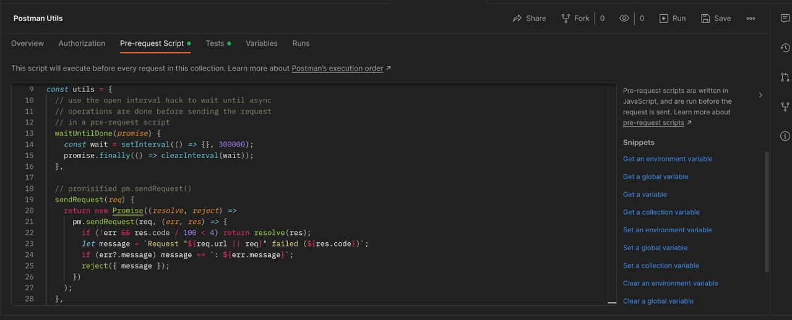
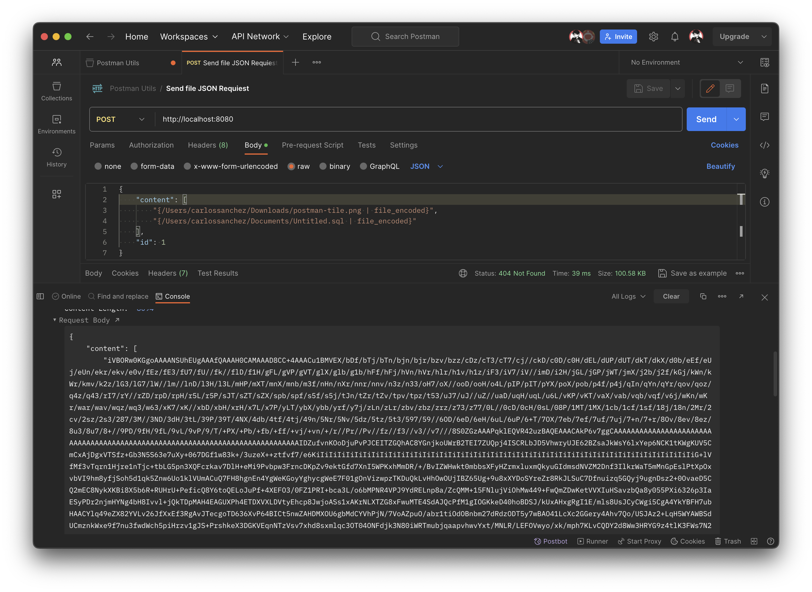

# Postman Utils
Postman Utils es un conjuto de utilidades que ayudaran a explotar las maximas capacidades de postman, y te ayudaran a ahorrate tiempo en ciertas caracteristicas para tus colecciones.

## Setup
Para hacer el uso de las utilidades, debemos copiar el contenido del archivo `postman-utils.js`, en la pestaña **Pre-request Script** de nuestra coleccion (Si tenemos mas de una coleccion debemos agreagarlo en cada una de ellas)



## Servidor
Para la utilizacion de algunas de las utilidades, se requiere ejecutar un servidor desarrollado en NestJS, para algunas funciones como la lectura de archivos, guardado entre otras funciones que postman no nos permite directamente, podremos ejecutar el servidor de la siguiente manera.
```bash
npm install
npm run start
```
El servidor se ejecutara en el puerto `8080`, puede ser cambiado desde el archivo `main.ts`, pero tambien debemos cambiar dicho puerto en nuestro  **Pre-request Script**


## Utilidades
Al terminar de agregar el script a nuestra coleccion, al realizar cualquer **Request** podemos hacer uso de las utilidades precargadas.

### Inyeccion de Archivos en Base64
Esta utilidad nos permite inyectar en nuestro **Request**, el contenido del archivo que hemos asignado en la peticion meidante una sentencia (Solo funciona para peticiones tipo raw: JSON o SOAP), para implementarlo se debe serguir la siguiente sentencia:
```json
{
    "content": "{path_file | file_encoded}",
    ...
}
```
Al agregar esta sentencia `utils.inyectedBase64FileRequiered`, busca mediante regex las sentencias que concidan con dicha cadena, por lo que nos permite agregar mas de un archivo con diferentes nombre o el mismo, ya que al obtener los archivos que estan adjuntos en el JSON, se envia una URL que puede ser el servidor incluido en el repositorio `postman-utils-server`, o cualqueir servidor backend que reciba el path y retornarnos con la siguientre estructura del archivo codificado
```json
{
  "content": "VBORw0KGgoAAAANSUhEUgAAAfQ...",
  "fileName": "content.txt"
}
```
Todos los archivos incluidos son consultados (Cualquier archivo que no exista o sel servidor no responda se asignara el valor null), al terminar de consultar los archivos se inyectara al request el contenido de la peticion, por loque no modificara le body escrito en la peticion.


# Referencias
Codigo original de **utils** creador por [erhhung](https://github.com/erhhung) en el foro **postmanlabs** https://github.com/postmanlabs/postman-app-support/issues/3480#issuecomment-857163165
